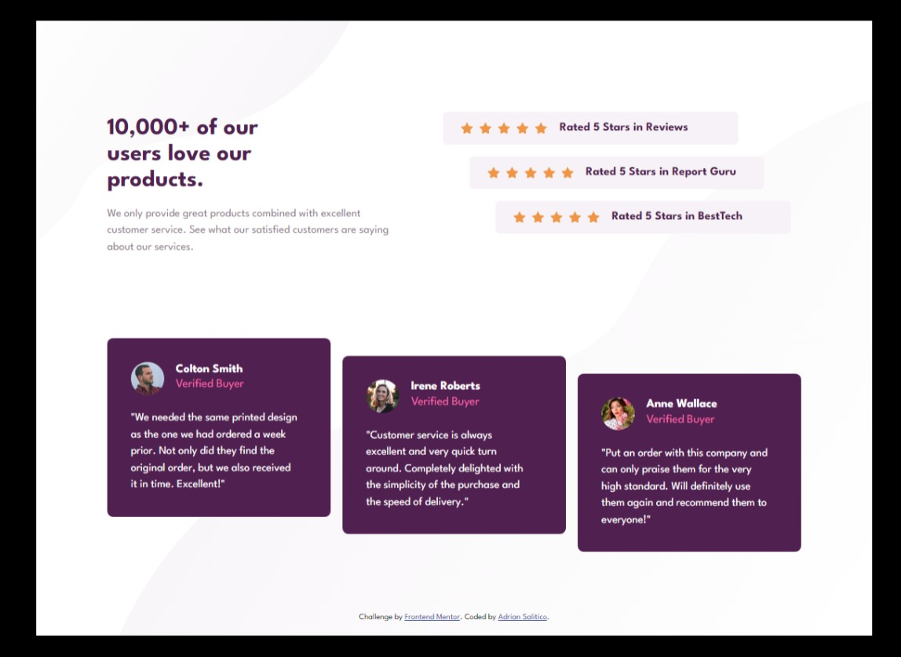
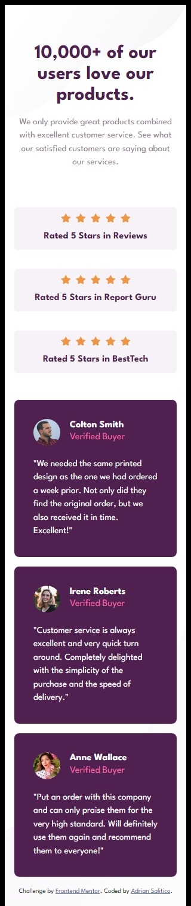

# Frontend Mentor - Social proof section solution

This is a solution to the [Social proof section challenge on Frontend Mentor](https://www.frontendmentor.io/challenges/social-proof-section-6e0qTv_bA). Frontend Mentor challenges help you improve your coding skills by building realistic projects.

## Table of contents

- [Overview](#overview)
  - [The challenge](#the-challenge)
  - [Screenshot](#screenshot)
  - [Links](#links)
- [My process](#my-process)
  - [Built with](#built-with)
  - [What I learned](#what-i-learned)
  - [Continued development](#continued-development)
  - [Useful resources](#useful-resources)
- [Author](#author)
- [Acknowledgments](#acknowledgments)

## Overview

### The challenge

Users should be able to:

- View the optimal layout for the section depending on their device's screen size

### Screenshot

#### Desktop Design



#### Mobile Design



### Links

- Solution URL: [https://github.com/Frogerall/social-proof-block](https://github.com/Frogerall/social-proof-block)
- Live Site URL: [https://frogerall.github.io/social-proof-block/](https://frogerall.github.io/social-proof-block/)

## My process

### Built with

- Semantic HTML5 markup
- CSS custom properties
- Flexbox
- Mobile-first workflow
- Saas/Scss - Css extenstion
- Media query
- Background Svg Positioning

### What I learned

Use this section to recap over some of your major learnings while working through this project. Writing these out and providing code samples of areas you want to highlight is a great way to reinforce your own knowledge.

To see how you can add code snippets, see below:

```css
.container {
 background-image: url(../images/bg-pattern-top-mobile.svg),
  url(../images/bg-pattern-bottom-mobile.svg);
 background-repeat: no-repeat, no-repeat;
 background-size: contain, 100% 50%;
 background-position: top left, bottom -18rem right;
 background-color: hsl(0, 0%, 100%);
 display: flex;
 flex-direction: column;
 padding: 1rem;
 @media (min-width: 600px) {
  background-image: url(../images/bg-pattern-top-desktop.svg),
   url(../images/bg-pattern-bottom-desktop.svg);
  background-repeat: no-repeat, no-repeat;
  background-size: auto, 100% 90%;
  background-position: top left -10rem, bottom 0rem right -7rem;
  width: 90%;
  margin: 3rem auto;
 }
}
```

## Author

- Website - [Adrian Salitico](https://www.your-site.com)
- Frontend Mentor - [@frogerall](https://www.frontendmentor.io/profile/frogerall)
- Twitter - [@saliticoadrian](https://www.twitter.com/saliticoadrian)

## Acknowledgments

This is where you can give a hat tip to anyone who helped you out on this project. Perhaps you worked in a team or got some inspiration from someone else's solution. This is the perfect place to give them some credit.
